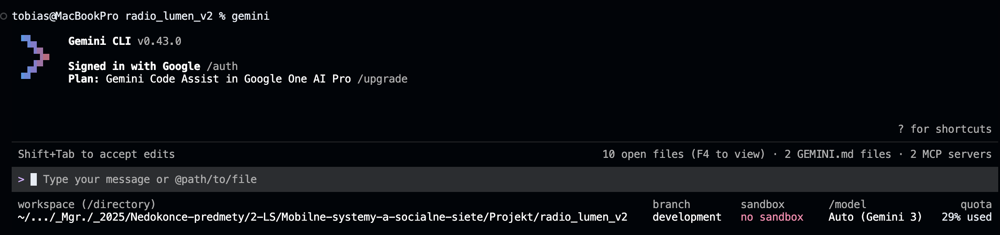
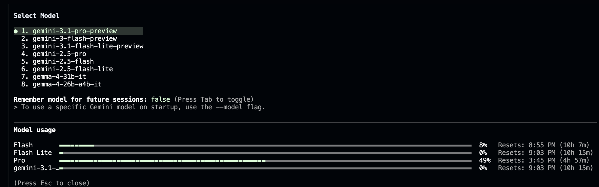
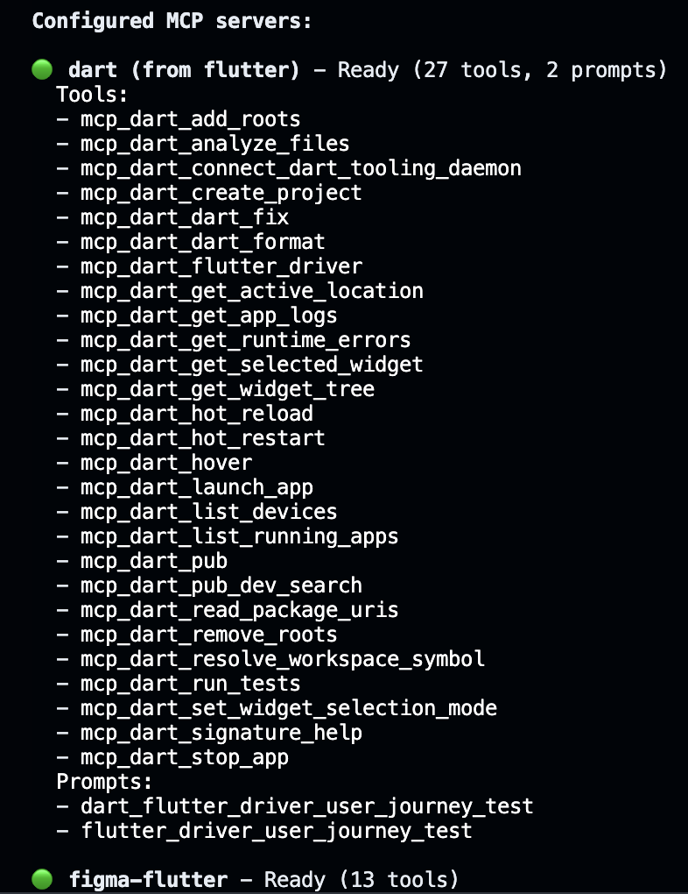
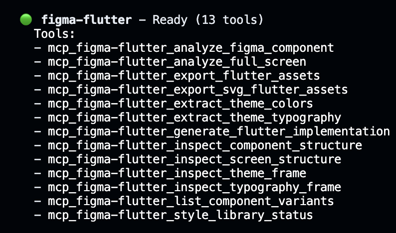

# Radio Lumen V2

Rádio Lumen je kresťanská rozhlasová aplikácia pre Android a iOS. Streamuje živý audio obsah vrátane hudby, modlitieb, rozhovorov a správ.

Existujúcu aplikáciu Rádio LUMEN (dostupná v [App Store](https://apps.apple.com/sk/app/r%C3%A1dio-lumen/id544631881) a [Google Play](https://play.google.com/store/apps/details?id=com.apptives.radiolumen&hl=en-US)) sme pretvorili na modernú Flutter aplikáciu.

## Hlavné vlastnosti

- _Živé online vysielanie_ – počúvanie programov reálnom čase bezplatne.
- _Mobilná aplikácia_ – prehľadné rozhranie na streamovanie priamo v smartfóne.
- _Program a relácie_ – aktuálny program, playlisty, rozpis relácií (hudba, modlitby, rozhovory, spravodajstvo).
- _Náboženský a kultúrny obsah_ – kresťanské hodnoty, liturgia, duchovné rozhovory a upokojujúca hudba.

### Snímky obrazoviek (GUI) & Figma Návrh

Odkaz na kompletný grafický návrh v nástroji Figma: [Radio Lumen V2 Design](https://www.figma.com/design/89dU7FTRcj3wbciK4XFjjY/Radio-Lumenv2-design?node-id=0-1&t=NWVYeSPxFkQqBeDg-0)

<p align="center">
  
  
  
  
</p>
<p align="center">
  
  
  
  
</p>
<p align="center">
  
  
  
  
</p>
<p align="center">
  
  
  
  
</p>
<p align="center">
  
</p>

## Požiadavky na prostredie

Pre úspešné spustenie projektu je potrebné mať nainštalované:

- _Flutter SDK_ (verzia 3.+)
- _Node.js_ (pre beh Gemini CLI nástrojov)

### Návod na spustenie

Zadať v konzoli:

```bash
flutter pub get
```

```bash
dart run build_runner build --delete-conflicting-outputs
```

```bash
flutter run
```

> **Poznámka k backendu:** Aplikácia nemá vlastný samostatný backend. Dáta o programe a novinkách získava dynamicky priamo z oficiálneho webu cez web scraping a audio streamy z verejných Icecast feedov. Pre spustenie teda nie je potrebná žiadna dodatočná konfigurácia serverových služieb.

## Zvolené LLM

Pôvodný plán bol využiť pri vývoji _GitHub Copilot_, keďže sme mali prístup k _Education Pack for Students_. Avšak v čase, keď sme po dôkladnom plánovaní chceli začať s vývojom, GitHub práve pozastavil svoje predplatiteľské služby.

- [Announcement & FAQ: Changes to GitHub Copilot Individual Plans](https://github.com/orgs/community/discussions/192963)
- [Changes to GitHub Copilot Individual plans](https://github.blog/news-insights/company-news/changes-to-github-copilot-individual-plans/)

Po zvážení iných možností a LLM nástrojov sme vybrali **Gemini od spoločnosti Google**. Konkrétne [Gemini CLI](https://geminicli.com/) + [Gemini CLI Companion rozšírenie](https://marketplace.visualstudio.com/items?itemName=Google.gemini-cli-vscode-ide-companion) vo VS Code.

Veľkou výhodou Gemini CLI je jeho schopnosť čítať inštruktážne súbory iných LLM, vďaka čomu sme nemuseli zložito prepisovať alebo upravovať existujúce inštrukcie pôvodne určené pre GitHub Copilot, ktoré boli uložené v `.github/copilot-instructions.md`. Pre potreby Gemini sme však vytvorili samostatný súbor `GEMINI.md`, v ktorom boli zadefinované operačné inštrukcie pre správanie AI agenta, pravidlá bezpečnej manipulácie s kódom a riadenie MCP nástrojov, pričom samotné architektonické pravidlá a konvencie asistent preberá z pôvodného súboru pre Copilot.

Inštalácia Gemini CLI v projekte:

```bash
npm install -g @google/gemini-cli
```

<p align="center">
  
</p>
<p align="center">
  
</p>

Aby sme zabezpečili, že kód vygenerovaný pomocou AI bude čo najkvalitnejší, nainštalovali sme do Gemini CLI aj oficiálne rozšírenie (MCP) pre Flutter. Toto rozšírenie rozširuje a dopĺňa pravidlá kvality kódu (code quality) z našich vlastných inštrukcií a zároveň v sebe integruje dodatočné nástroje na testovanie a statickú analýzu čistoty kódu. Okrem toho sme integrovali aj Figma Flutter MCP pre priamu prácu s grafickými návrhmi a UI podkladmi z platformy Figma.

- [Figma Flutter MCP](https://github.com/mhmzdev/figma-flutter-mcp)
- [Gemini CLI Flutter extension](https://geminicli.com/extensions/?name=gemini-cli-extensionsflutter)

```bash
{
  "mcpServers": {
    "dart": {
      "command": "dart",
      "args": ["mcp-server"]
    },
    "figma-flutter": {
      "command": "npx",
      "args": ["-y", "figma-flutter-mcp", "--stdio"],
      "env": {
        "FIGMA_API_KEY": "${FIGMA_API_KEY}"
      }
    }
  }
}
```

<p align="center">
  
  
</p>

### Iné použité AI nástroje

Pre konzultáciu, otázky a iné veci boli použité tieto AI:

- _Platený Google Gemini Plus & Pro_
- _Platený Perplexity Pro (Claude Sonnet 4.6 Thinking model)_

### Prínosy a nevýhody

#### Porovnanie modelov (Gemini Plus vs. Gemini Pro)

Významným faktorom pri práci s Gemini CLI bol rozdiel v efektivite a manažmente kontextového okna (spotrebe tokenov) medzi verziami Gemini Plus a Gemini Pro. Rozdiel bol najviac citeľný pri komplexnejjších a náročnejších úlohach. Zatiaľ čo verzia Pro pracovala veľmi úsporne (priemerne náročná úloha spotrebovala len cca 2 % až 5 % tokenov), verzia Plus vykazovala podstatne vyššiu spotrebu, často okolo 10 % na jednu úlohu. To výrazne obmedzovalo plynulosť a efektivitu práce pri dlhších sedeniach (Samozrejme berieme do úvahy, že počet použiteľných tokenov sa pri Gemini Plus a Pro výrazne lýši). Zo subjektívneho hľadiska sa model Gemini Pro ukázal ako finančne nenáročné a vysoko návratné riešenie.

#### Hlavné prínosy

**Efektivita Gemini CLI a MCP:** Veľkým benefitom bola schopnosť nástroja rýchlo a presne pracovať s lokálnymi súbormi a prostrednívom MCP (Model Context Protocol) analyzovať štruktúru Figma projektov. Podmienkou úspechu boli dostatočne detailné a sémanticky jasne napísané úlohy.
**Testovanie funkcionality úloh:** Gemini CLI sa ukázal ako mimoriadne efektívny pomocník pri spracovávaní a validácii funkčných testov pre už hotové úlohy. Dokázal rýchlo overiť správnosť implementácie a odhaliť prípadné logické nedostatky, čo výrazne urýchlilo fázu kontroly kódu. Nehovoriac o tom, že pri erroroch počas testovacích fáz automaticky riešil aj opravu kódu až kým testy nevyšli úspešne.

<p align="center">
  
</p>
<p align="center">
  
</p>
<p align="center">
  
</p>
<p align="center">
  
</p>
<p align="center">
  
</p>

#### Nevýhody a technické obmedzenia

**Nestabilita spojenia s Figma API:** Pri integrácii s platformou Figma sme narážali na technické obmedzenie na strane ich API. Bezpečnostné mechanizmy Figmy a striktné limity na frekvenciu dopytov (rate limiting) vyhodnocovali intenzívne čítanie dizajnových vrstiev cez Gemini CLI ako podozrivú aktivitu (automated scraping), čo viedlo k predčasnému ukončovaniu relácií a odpájaniu API tokenu.
**Alternatívne riešenie:** Tento problém sme riešili buď opakovaným generovaním nových API kľúčov, alebo vkladaním screenshotov používateľského rozhrania priamo do vyhradených súborov v projekte. Nástroj dokázal vďaka pokročilému vizuálnemu engine spracovať vizuálne podklady s prekvapivou presnosťou a efektivitou.

### Osvojenie práce s AI inštrukciami a plánovaním

Významnou súčasťou našej skúsenosti bolo osvojenie si práce so špeciálnymi inštrukčnými súbormi, ktoré slúžili ako „dlhodobá pamäť“ a súbor pravidiel pre AI agenta. Tento prístup výrazne zvýšil efektivitu vývoja a konzistenciu kódu:

- **Definícia globálnych pravidiel:** Súbor `.github/copilot-instructions.md` sme využili na presné zadefinovanie architektúry projektu (Feature-First) a kódovacích štandardov. Vďaka tomu AI automaticky dodržiavala dohodnuté konvencie bez nutnosti opakovaného vysvetľovania v každom prompte.
- **Riadenie správania agenta:** V súbore `GEMINI.md` sme definovali operačné inštrukcie pre správanie AI agenta, pravidlá bezpečnej manipulácie s kódom a riadenie MCP nástrojov.
- **Iteratívne plánovanie a roadmapa:** Proces vývoja sme riadili cez `PLAN.md`. Tento súbor slúžil ako živý dokument, kde sme s AI asistentom spoločne navrhovali kroky implementácie, sledovali progres a koordinovali delegovanie úloh. AI dokázala na základe tohto plánu udržiavať kontext o celkovom stave projektu.

Tento systém nám ukázal, že kvalita výstupu LLM priamo závisí od kvality dodaného kontextu a inštrukcií. Naučili sme sa, že moderný vývoj s podporou AI nie je len o písaní promptov, ale najmä o **správe kontextu a definovaní mantinelov**, v ktorých sa asistent pohybuje.

## Zoznam technológií a použitých knižníc

### Jadro a navigácia

- _Dart_ & _Flutter_ (Android & iOS)
- _go_router_ (deklaratívna navigácia a deep linking)
- _flutter_localizations_ & _intl_ (podpora pre i18n a l10n)

### Správa stavu a generovanie kódu

- _Riverpod_ (moderná správa stavu s využitím generovania kódu)
- _freezed_ (nemenné dátové modely)
- _json_serializable_ (serializácia a deserializácia JSON)
- _build_runner_ (štandardizovaný nástroj na generovanie kódu)

### Sieť a dáta

- _dio_ (pokročilý HTTP klient pre sieťovú komunikáciu)
- _connectivity_plus_ (monitorovanie stavu sieťového pripojenia)
- _html_ (parsovanie HTML pre web scraping programu)
- _xml_ (parsovanie XML pre špecializované dátové feedy)

### Audio a médiá

- _just_audio_ (streamovanie a prehrávanie audia)
- _audio_service_ (prehrávanie na pozadí, ovládanie na uzamknutej obrazovke)
- _flutter_svg_ (vykresľovanie SVG pre Figma vektorové ikony)
- _marquee_ (bežiaci text pre dlhé názvy skladieb a relácií)

### UI a prostriedky (Assets)

- _google_fonts_ (dynamická typografia)
- _flutter_native_splash_ (generovanie natívnej úvodnej obrazovky)
- _flutter_launcher_icons_ (správa ikon aplikácie)
- _Figma Flutter MCP_ (AI generovanie widgetov priamo z návrhov vo Figme)

### Utility a služby

- _shared_preferences_ (lokálne úložisko pre nastavenia)
- _share_plus_ (systémové zdieľanie obsahu)
- _url_launcher_ (otváranie externých URL adries a aplikácií)
- _package_info_plus_ (získavanie informácií o verzii a builde aplikácie)

## Getting Started

This project is a starting point for a Flutter application.

A few resources to get you started if this is your first Flutter project:

- [Learn Flutter](https://docs.flutter.dev/get-started/learn-flutter)
- [Write your first Flutter app](https://docs.flutter.dev/get-started/codelab)
- [Flutter learning resources](https://docs.flutter.dev/reference/learning-resources)

For help getting started with Flutter development, view the
[online documentation](https://docs.flutter.dev/), which offers tutorials,
samples, guidance on mobile development, and a full API reference.
